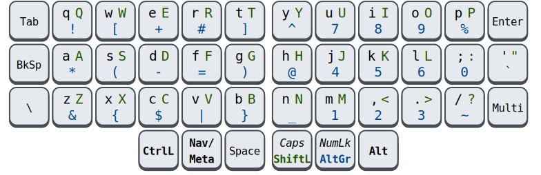
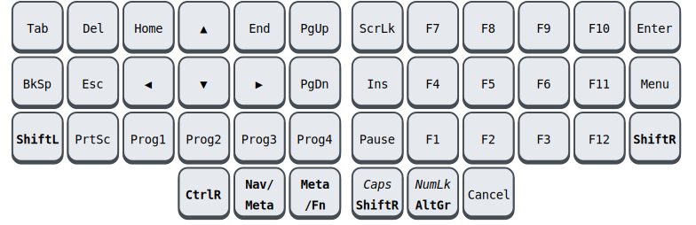

# 🧙 Handalf

*I only uploaded this so that it may serve as inspiration. It is still 
being tweaked. The README may not completely match the implementation. 
It currently only supports Linux.*

Touch typing on a standard keyboard is not a great experience. Your 
thumbs idle while your weakest finger contorts to reach keys like 
<kbd>Esc</kbd> and <kbd>BkSp</kbd>. Numbers and other common symbols 
require you to abandon a comfortable hand position entirely. Exotic 
keyboards can remedy all this, but lack portability.

Handalf is a keyboard layout that works well for fancy keyboards with 2 
or more thumb keys per hand, but that *also* fit broadly within the 
constraints of a laptop keyboard.

-   **Each finger travels one key at most.** Your thumbs pick up the slack.
-   **Easy to remember.** All symbols are accessible with just one of 
    the normal <kbd>Shift</kbd> and <kbd>AltGr</kbd> modifiers, without 
    combining them. There is only *one* additional layer for navigation 
    and function keys — and that's it.
-   **One-handed control.** The number pad can be operated with just the 
    right hand. Navigation keys can be reached with just the left, 
    freeing your hand for the mouse. Unfortunately, this also means that 
    the layout is biased towards right-handed people.
-   **Graceful degradation.** You can keep a somewhat consistent layout 
    even when you're stuck on a laptop keyboard. Only the backslash key 
    <kbd>\\</kbd> functions slightly differently.
-   **Incremental learning.** You don't need to learn everything all at 
    once. I've found the symbols under <kbd>AltGr</kbd> to be the most 
    ergonomically significant --- it's a great place to start.
-   **Regressions are avoided.** When stuffing so much functionality in 
    a limited space, it is inevitable that some key sequences will 
    become hard to generate. However, care has been taken to make few 
    assumptions about the programs you will be running. That is, all 
    modifiers should still stack in an intuitive and consistent way, and 
    no reasonable shortcut should be made impossible or even just 
    cumbersome to type.
-   **No homerow mods.** While typing at speed, keypresses will often 
    overlap, which means that any attempt at overloading alpha keys must 
    resort to timeouts. This introduces [visual delay][pftwp] and can 
    cause misfiring. There are [ways][urob] to mitigate this and train 
    yourself to work with it, but I have not made that sacrifice here.
-   **Overloading is used sparingly.** Even on non-alpha keys, 
    overloading has the above downsides, albeit to a lesser degree. 
    Therefore, only *one* key has been overloaded: <kbd>Esc</kbd> 
    accesses a layer when held. This is considered safe because `Esc` 
    tends to punctuate a keystroke and a misfire is not catastrophic. 
    The `Esc` is only registered when the tap is short.
-   **Stateless.** Well, almost. You shouldn't need to remember what 
    'mode' your keyboard is in: all symbols depend only on what keys you 
    are *currently* pressing, or perhaps which keys you were pressing 
    some fraction of a second ago.

Above all, the layout should **feel good**. Many things are taken into 
consideration: simplicity, rolling motions, muscle memory, semantic 
clustering, symmetry, avoiding mixing action keys with letter keys, 
etcetera. Final prioritization based on vibes. :)

## Symbol keys

There isn't much of a barrier to entry: if you are currently using 
something similar to a US layout, like Colemak or Workman or good ol' 
Qwerty, then all alpha keys will stay in the same place. The major 
addition is that the Level-3 symbols on those keys (accessed through 
<kbd>AltGr</kbd>) have been crammed full with numbers and the other 
ASCII symbols for which you would normally have had contort your hands.

<!-- Because AltGr is pressed with your right-hand thumb, the left-hand 
side of the keyboard is preferred for things like parentheses, while the 
number pad can now be controlled entirely with your right-hand. -->

## Action keys

On the left side of the Space, what would have been your <kbd>Alt</kbd>, 
is now your *action* layer. When you *hold it*, it reveals a navigation 
cluster, the Meta modifier, F-keys, and other common keys.

Pressing space while in this layer turns it into *Meta* (also sometimes 
referred to as the *Super*, *Windows*, *OS* or *GUI*-key). This plays 
well with the convention of bringing up some sort of menu upon tapping 
*Meta*.

Admittedly, the above is a simplification. In the **Fn** layer, the 
navigation cluster is placed so that you can control the directional 
keys with only your left hand. On the other hand (literally), the F-keys 
are not often used in modern applications. That is why holding the 
<kbd>Esc</kbd> key brings up the **Fn**-layer only on the *left* side, 
whereas the *right* side instead exposes *Meta*-keys, easily accessible 
for mapping actions in your window manager. When you *also* hold 
*Space*, this is flipped around, as the left-hand *Meta*-keys and 
right-hand F-keys are exposed. This is, in my opinion, the most 
distressing aspect of the layout, but it is worth it for the practical 
convenience it brings.

## Other changes

- <kbd>BkSp</kbd> takes the place of <kbd>Caps</kbd>, avoiding the huge 
  move your pinky would have made.

- <kbd>Esc</kbd> is given an easily accessible spots for your left 
  thumb, since it is useful for modal applications like Vim.

- <kbd>Shift</kbd> and <kbd>AltGr</kbd> are modifiers, but unlike 
  <kbd>Ctrl</kbd> and <kbd>Alt</kbd>, they don't access shortcuts — they 
  simply provide more symbols. To make for a more comfortable typing 
  experience, these keys are made *sticky* (or *oneshot*). Instead of 
  holding and consciously releasing them *just* before pressing the next 
  unmodified key, you can just tap once and forget about it. MUch 
  better!

- You will often need a decimal point while typing numbers, but it is 
  cumbersome to exit the symbol layer just to grab one and return. The 
  same holds for the underscore when typing in all-caps. For this 
  reason, double-tapping <kbd>Space</kbd> while holding <kbd>AltGr</kbd> 
  will emit a decimal point (resulting in `.` or `,` depending on your 
  locale), and doing so while holding <kbd>Shift</kbd> will emit an 
  underscore `_`.

- The <kbd>Multi</kbd> key (also called *Compose*) allows you to type 
  special characters by typing intuitive keys in succession. For 
  example, <kbd>Multi</kbd><kbd>c</kbd><kbd>=</kbd> becomes `€`.

- In general, it doesn't matter whether you press the right or left 
  variant of a modifier, so, in general, we choose the left. However, 
  pulling up a menu or escaping a virtual machine sometimes involves 
  tapping a specific modifier on the right side, which is accommodated 
  by pressing that modifier in the action layer.

### Shift

We need a clever way to compromise on the lack of thumb keys on a laptop 
keyboard, in as unobtrusive a way as possible. My solution is the 
following:

Ideally, the bottom-left key will be the backslash, but on a laptop, 
this key will retain its function as <kbd>Shift</kbd>. In the Shift- and 
AltGr-layers, it is then *also* a backslash. That is, double tapping 
<kbd>Shift</kbd>, or tapping while holding <kbd>AltGr</kbd>, will get 
you `\`, and if you keep holding the key, the associated Shift modifier 
will stay active.

Because `\` is often for escaping, it will normally be combined with 
special characters, and thus, you would have needed to activate 
<kbd>AltGr</kbd> or <kbd>Shift</kbd> *anyway*. In this way, we retain an 
easily accessible <kbd>Shift</kbd> on generic keyboards, including 
oneshot behaviour, without wasting a good spot for a useful symbol key. 

The same reasoning goes for the compose key on the opposite edge.

# Keysyms

When you press a key, your keyboard will send a *scancode* to the 
computer; the kernel maps that to a *keycode*; and finally, your 
keyboard layout considers that keycode (along with the active modifiers) 
and emits a *keysym*.

Handalf remaps *symbols* at this keysym level, while other keys are 
mapped at the scan- or keycode-level. Teasing the two apart like this 
has several benefits:

- At the scan- and keycode-level, more tricks can be applied, like 
  overloading.
- But at the keysym-level, you can switch between symbol layouts in the 
  standard way --- and they will apply to all keyboards, regardless of 
  firmware.
- Users can try the <kbd>AltGr</kbd> symbols, without committing to the 
  rest.
- It becomes easier to reason to reason about key composition. We don't 
  have to explicitly write and remember rules for how the various layers 
  and modifiers combine. Suppose, for example, you want to zoom in with 
  <kbd>Ctrl</kbd><kbd>+</kbd> --- you can rely on your muscle memory to 
  type that first key as <kbd>Esc</kbd><kbd>a</kbd> and the second as 
  <kbd>AltGr</kbd><kbd>e</kbd>.
- For layout-independent keybindings in your window manager, it is 
  important that emitted keycodes stay the same even as symbols change.

Holding <kbd>Shift</kbd> and <kbd>AltGr</kbd> together does not change 
the keysyms, but it does change the keycode. This is helpful in 
situations where an application monitors

## Arrow keys

Tricks can be handy, but they must not require conscious thought. For 
example: you will usually use the arrow keys while typing a sentence, 
but the next key may overlap with the activation of Fn. For this reason, 
the Super modifier will be disabled when pressing something in the `Fn` 
layer some milliseconds after using the arrow keys.

# Suggested tweaks

- Swap the overload to Esc to an overload to Meta.
- Swap the left/right halves of **Nav/Meta** and **Meta/Fn** so that you 
  get only a **Nav/Fn** and **Meta** layer.

## Usage and installation

Install [keyd](https://github.com/rvaiya/keyd) (version >=2.3) and run 
`sudo make install`. Activate the `handalf` layout in your environment.

<!--
## Other

[Seniply] and [Callum] have similar goals: limited keys and no home-row 
mods.

# Consideration for the thumb keys

-   All thumb keys except space are modifiers or layer keys, because you 
    have full range of motion with the rest of your fingers while 
    holding them.
-   Since we avoid crazy modifier combinations, `sym` and `shift` never 
    make sense to press together. Therefore, they should be on the same 
    finger.
-   `space` should be opposite from  `shift` and `sym`, so that you can 
    still use it while in their respective modes.

-->

<!-- Reading -->
[Preconditions-Guide]: https://precondition.github.io/home-row-mods
[Urob]: https://github.com/urob/zmk-config#timeless-homerow-mods
<!-- About visual latency -->
[pftwp]: https://pavelfatin.com/typing-with-pleasure/#human-side

<!-- Layouts -->
[Colemak-DH]: https://colemakmods.github.io/mod-dh/
[Workman]: https://workmanlayout.org/

<!-- More layouts -->
[Seniply]: https://stevep99.github.io/seniply/
[Callum]: https://github.com/callum-oakley/qmk_firmware/tree/master/users/callum
[Miryoku]: https://github.com/manna-harbour/miryoku
