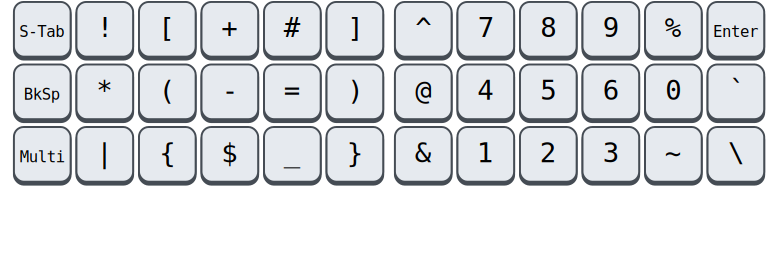
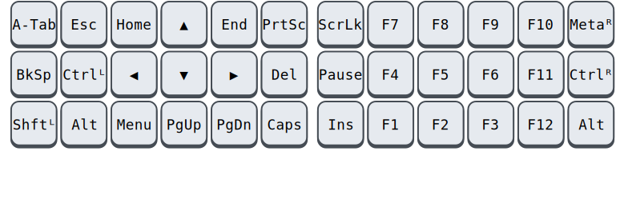
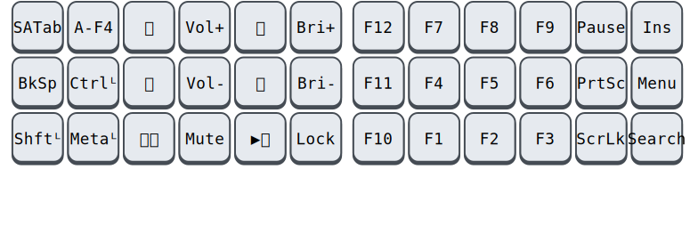

# 🧙 Handalf

*I only uploaded this so that it may serve as inspiration. It is still 
being tweaked. The README may not completely match the implementation. 
It currently only supports Linux.*

## Philosophy

Touch typing on a standard keyboard is not a great experience. Your 
thumbs idle while your weakest finger contorts to reach keys like 
<kbd>Esc</kbd> and <kbd>BkSp</kbd>. Numbers and other common symbols 
force your hands to abandon the home row entirely. Exotic keyboards can 
remedy all this, but lack portability.

Handalf is a 42-key layout scheme that works well for fancy 40% 
keyboards with 3 thumb keys per hand, but it *also* fits comfortably 
within the constraints of a laptop keyboard.

-   **Each finger travels one key at most.** Your thumbs pick up the 
    slack.
-   **Graceful degradation.** You can keep a consistent layout, even 
    when you're stuck on a laptop keyboard.
-   **Easy to learn & remember.** You may be able to keep your letter 
    keys unchanged, and all other symbols are accessible with just 
    <kbd>AltGr</kbd> modifier. There is one additional layer beyond 
    that, for navigation keys. Combined with <kbd>AltGr</kbd>, you get 
    function and media keys. There's no need to learn it all at once: 
    I've found the symbols under <kbd>AltGr</kbd> to carry the most 
    ergonomic benefit.
-   **No homerow mods.** While typing at speed, keypresses will often 
    overlap, which means that any attempt at assigning multiple 
    functions to the spacebar or alpha keys must resort to timeouts. 
    This introduces [visual delay][pftwp] and can cause misfires. You 
    can train yourself and there are other [ways][urob] to mitigate it, 
    but I have not made such sacrifices here.
-   **Overloading is used sparingly.** Even for non-alpha keys, 
    overloading has the above downsides, albeit to a lesser degree. 
    Therefore, only a *single* key is given double duty, and it is done 
    judiciously.
-   **Stateless.** Modal editors are great, but only because they can 
    provide continuous feedback about the current mode. Without glancing 
    at the keyboard, the only association upon which your brain can 
    build is tactile: the physical position of your hands. Therefore, 
    the key sent to your computer will depend *only* on the keys you are 
    currently pressing, or, at most, which keys you were pressing some 
    fraction of a second ago.
-   **Complete.** When stuffing so much functionality into a cramped 
    space, it is inevitable that some key sequences will become harder 
    to type. However, our 42 keys should give access to *every* key that 
    you might find on a tenkeyless keyboard. I have avoided assumptions 
    about the software you will be running, and yet sought to find an 
    arrangement of keys that fits within the established software 
    ecosystems. All modifier combinations remain available, and they 
    should still stack in an intuitive and consistent way.

Above all, the layout should *feel* good. Many ideals are taken into 
consideration, like simplicity, rolling motions, muscle memory, semantic 
clustering, symmetry, separating actions from symbols, etcetera --- but 
the final decision is based on vibes. A good mapping will almost 
immediately render its absence on other keyboards painful.

Unfortunately, Handalf is biased toward right-handed people. Let me know 
if you have a left-handed layout following the same principles.

## A word of caution

Many lower-end keyboards, and in particular integrated keyboards on 
laptops, have limited rollover --- meaning that they cannot physically 
register all combinations of keys. Keep this in mind when you run into 
issues.

## Layers

### Symbol keys

If you are currently using Colemak, Workman or good old Qwerty/Azerty, 
then all alpha keys can stay put. The major addition is that the 
**Level-3 symbols** on those keys (accessed through <kbd>AltGr</kbd>) 
have been crammed full with numbers and the other ASCII symbols.

While pressing <kbd>AltGr</kbd>, the left-hand side of the keyboard 
provides comfortable cross-hand access to common symbols like 
parentheses, while the number pad can be operated entirely with your 
right hand.

### Action keys

The key to the left of <kbd>Space</kbd>, the one that would have been 
your <kbd>Alt</kbd>, is now the <kbd>Fn</kbd> key. This key accesses a 
layer for keys that perform *actions* rather than symbols.

Here, the navigation cluster is placed so that you can control the 
directional keys with only your left hand.

The keys on your right hand are the usual letter keys augmented with 
both the <kbd>Alt</kbd> and <kbd>Meta</kbd> modifiers. This is intended 
to be used for custom window manager shortcuts.

### Media keys

F-keys and media control keys are obtained by combining the **Fn** layer 
with the <kbd>AltGr</kbd> modifier.

Numpad keys have been left out of the layout for now.

## Backspace

<kbd>BkSp</kbd> takes the place of <kbd>CapsLk</kbd>, avoiding the huge 
move your pinky would have had to make.

<kbd>CapsLk</kbd>, in turn, can be activated by pressing both left and 
right <kbd>Shift</kbd> (or double tapping <kbd>Shift</kbd>).

## Overloading <kbd>Fn</kbd>/<kbd>Esc</kbd>

The <kbd>Fn</kbd> key occupies a very accessible location. Since it does 
not map to a conventional key anyway, you might be tempted, as I was, to 
give it double duty: to make it do something else when it is tapped in 
isolation.

If you are a Vim user, one key in particular might come to mind. You 
need it all the time and it tends to punctuate a sequence of keystrokes, 
so it is relatively easy to disambiguate your intent.

Indeed, it is entirely reasonable to overload <kbd>Fn</kbd> with 
<kbd>Esc</kbd>. However, when you accidentally trigger <kbd>Esc</kbd>, 
it can be *really* annoying. Outside of Vim, it wreaks havoc by closing 
windows, losing focus on input fields, and erasing the spreadsheet 
formula you just typed.

That is why I have chosen to overload it with <kbd>Cancel</kbd> instead 
--- a key that is barely used and not even present on contemporary 
keyboards. Specific applications can then be explicitly configured to 
interpret this key in a useful way, so that the effect is limited to 
where it makes sense.[^1] In foot, you would put `\x1b = Cancel` in the 
`[text-bindings]` section, and in Alacritty, you would put `bindings = 
[{key = "Cancel", mods = "None", chars = "\u001b"}]` in the `[keyboard]` 
section.

[^1]: You could even directly configure (Neo)Vim itself to interpret 
    your special key (see 
    [key-notation](https://neovim.io/doc/user/intro.html#_keycodes)), 
    but since most terminal emulators do not support wacky keys (cf. 
    `terminfo`), you would need to use another key.

## The Compose key

The <kbd>Multi</kbd> key (also called the Compose key) allows you to 
type special characters by typing intuitive keys in succession. For 
example, <kbd>Multi</kbd><kbd>=</kbd><kbd>c</kbd> becomes `€`.

It is *virtual*, in the sense that there is no physical key that has 
this property by default. You need to assign it on the software level.

In the Handalf XKB layout, Compose is accessible by tapping the 
<kbd>Fn</kbd> key while holding <kbd>Shift</kbd> or <kbd>AltGr</kbd> (or 
vice versa). This is convenient, firstly because it does not obscure any 
keys you might want to use for something else, and secondly because many 
subsequent symbols already require you to hold one of these modifiers 
anyway.

## Copy/paste/cut

The **Fn** layer contains dedicated <kbd>Cut</kbd>, <kbd>Copy</kbd>, and 
<kbd>Paste</kbd> keys. This keeps these keys in the same spot regardless 
of the layout of your alphanumerics, but more importantly: they can be 
used in some terminal emulators (without the need to distinguish the 
`^C` signal from copying).

## Alt-Tab

Many computer users will have muscle memory associated with 
<kbd>Alt</kbd><kbd>Tab</kbd>, so pressing <kbd>Tab</kbd> in the **Fn** 
layer will still emit exactly that. It will also keep the <kbd>Alt</kbd> 
modifier active until you either exit the **Fn** layer, or press another 
key in the **Fn** layer. This keeps the window list in view, just as it 
would be in the original situation holding <kbd>Alt</kbd>.

## Decimal point and underscore

You will often need a decimal point while typing numbers, but it is 
cumbersome to disable **AltGr** just to grab one and return. The same 
holds for the underscore when typing in all-caps. For this reason, 
tapping left <kbd>Shift</kbd> while holding <kbd>AltGr</kbd> will emit a 
decimal point (resulting in `.` or `,` depending on your locale), and 
doing so while holding right <kbd>Shift</kbd> will emit an underscore 
`_`.

## Modifiers and layers

Modifiers are keys like <kbd>Shift</kbd>, <kbd>AltGr</kbd>, 
<kbd>Ctrl</kbd>, <kbd>Alt</kbd>, and <kbd>Meta</kbd>. These keys are 
sent along with the key you press, for your software to interpret. A 
layer key like <kbd>Fn</kbd> is similar, but it modifies the key 
directly, before it even leaves the (virtual) keyboard.

The position of modifier and layer keys is fundamental to the layout: 
they change everything your other fingers can do. Therefore, I 
considered many different permutations, eventually landing on the 
following insights:

- Ideally, these keys should be your thumbs' responsibility, because 
  that makes it easy to combine them with other keys.
- The symbol modifiers, <kbd>Shift</kbd> and <kbd>AltGr</kbd>, should be 
  on the hand opposite from <kbd>Space</kbd>. They don't need to be 
  combined, so they can be on the same hand.
- The order in which you activate modifiers and layers should not 
  matter. That is, holding <kbd>Fn</kbd> and then <kbd>Alt</kbd> should 
  have the same effect as the other way around.
- You should not have to press more than one key to activate a layer or 
  modifier.
- It should be assumed that the fingers are in the home row position; 
  shifting your fingers a column or row is not comfortable on sculpted 
  keyboards like the Kinesis Advantage, MoErgo Glove80, Dactyl, or 
  Keyboardio Model 100.
- When overloading a modifier, consider potential misfires: choose 'tap' 
  and 'hold' actions that are not destructive. This is easier to do when 
  associating the overloaded key with Window Manager actions.

### Sticky modifiers

<kbd>Shift</kbd> and <kbd>AltGr</kbd> are are modifiers that you use in 
the context of a longer sequence --- since they expose symbols rather 
than actions. To make for a more comfortable typing experience, these 
keys are made *sticky* (or *oneshot*). Instead of holding and 
consciously releasing them *just* before pressing the next unmodified 
key, you can just tap once and forget about it. MUch better!

<!-- ### CapsLock and NumLock -->

<!-- Double tapping <kbd>Shift</kbd> on its own gets you <kbd>CapsLk</kbd> --> 
<!-- and double tapping <kbd>AltGr</kbd> gets you <kbd>NumLk</kbd>. -->

### Left and right modifier variants

In general, it doesn't matter whether you press the right or left 
variant of a modifier, so we choose the left variant when the key occurs 
on the the left side (left <kbd>Alt</kbd>) and the right variant when 
the key occurs on the right side (right <kbd>Shift</kbd>, 
<kbd>AltGr</kbd>, and right <kbd>Ctrl</kbd>).

But all variants should be available:

- Some tasks, like escaping a virtual machine, may involve tapping a 
  specific side.
- I want to accommodate typing inconvenient modifier combinations, like 
  <kbd>Ctrl</kbd><kbd>Shift</kbd>, in which one of your thumbs is 
  already occupied.
- <kbd>Shift</kbd> should be available to the left pinky still, because 
  sometimes it needs to be pressed while using the mouse. Similarly, I 
  want shortcuts involving <kbd>Cntrl</kbd> to remain easy to type with 
  the left hand, even if your right hand is on the mouse, or if you're 
  on a laptop keyboard without a thumb key for <kbd>Ctrl</kbd>.

Therefore, in the **Fn** layer, your left pinky accesses a sticky left 
<kbd>Ctrl</kbd>. The **Fn** layer itself is then temporarily disabled. 
This makes it very easy to hit common shortcuts like 
<kbd>Ctrl</kbd><kbd>s</kbd>.

In many operating systems and desktop environments, there exists a 
convention to open a global menu upon tapping the <kbd>Meta</kbd> key 
(also sometimes referred to as the *Super*, *Windows*, *Command* or 
*GUI*-key). On a laptop keyboard, right <kbd>Meta</kbd> is easy to tap, 
because you can press <kbd>Fn</kbd> with your left thumb and 
<kbd>Space</kbd> with your right one. But saner keyboards where the 
right thumb can't reach <kbd>Space</kbd> need a left variant too --- 
which is why the pinky also gets a non-sticky left <kbd>Meta</kbd>.

It does violate our design principles to hide modifier keys behind other 
keys. There are real downsides: you can't combine these modifiers with 
other keys in **Fn**, and typing complex combinations may cause you to 
pause to think. This compromise is acceptable, because these are 
second-class variants anyway; their thumb counterparts should be used in 
the general case.

## Remapping scancodes, keycodes or keysyms

When you press a key, your keyboard will send a *scancode* to the 
computer; the kernel maps that to a *keycode*; and finally, your 
keyboard layout considers that keycode (along with the active modifiers) 
and emits a *keysym*. Remappings can take place at any of these levels.

- At the scan- and keycode-level, more tricks can be applied, like 
  overloading.
- But at the keysym-level, your OS is aware of your active layout. You 
  can switch between them in the standard way, with some visual 
  indication.
- For layout-independent shortcut bindings, it is desirable that emitted 
  keycodes stay the same even as the keysyms change.
- I have run into some applications that listen to keycode 
- The major drawback to remapping symbols at the keysym level is that 
  you need to install a layout to the system that you're using.
- On the other hand, the other approaches require that you have control 
  over the keyboard firmware or run a virtual keyboard like `keyd`.

For maximum compatibility, Handalf remaps at the scan- or keycode level. 
Nevertheless, it also ships with an XKB layout that remaps 
<kbd>AltGr</kbd> symbols at the keysym level. Both approaches can be 
active simultaneously without issues.

## Keyboard controls

The following section is only relevant for firmware implementations.

Keystrokes for control of the keyboard *itself*, such as those handling 
Bluetooth connectivity, should not obscure any keystroke that might be 
used by an applications. For that reason, they are hidden away behind 
*combinations of keys on the same column*. To avoid incurring any lag, 
this is further limited to when all left thumb controls are 
simultaneously pressed (that is, when the <kbd>Alt</kbd> and right 
<kbd>Meta</kbd> modifiers as well as the **Fn** layer are simultaneously 
activated).

### Bluetooth

For Bluetooth connectivity, the top two keys on columns 1 through 5 
connect to the corresponding profile, the bottom two keys disconnect 
that profile, and pressing all three clears the profile. Pressing all 3 
buttons on column 0 clears all profiles.

### Compatibility mode

Handalf uses some keys that are not present on standard contemporary 
keyboards. As a result, they may not be recognized out of the box by all 
applications, and not even all operating systems.

That is why a compatibility mode exists that replaces the funkier keys 
as follows:

| Key               | Replacement                 |
|-------------------|-----------------------------|
| <kbd>Cancel</kbd> | <kbd>Esc</kbd>              |
| <kbd>Cut</kbd>    | <kbd>Ctrl</kbd><kbd>X</kbd> |
| <kbd>Copy</kbd>   | <kbd>Ctrl</kbd><kbd>C</kbd> |
| <kbd>Paste</kbd>  | <kbd>Ctrl</kbd><kbd>V</kbd> |
| <kbd>Lock</kbd>   | <kbd>Meta</kbd><kbd>L</kbd> |
| <kbd>Close</kbd>  | <kbd>Alt</kbd><kbd>F4</kbd> |
| <kbd>Search</kbd> | <kbd>Meta</kbd><kbd>S</kbd> |

These keys are more widely recognized across all operating systems 
without further configuration, but you do lose out on some of the subtle 
benefits described in earlier sections.

Pressing the top two keys in the rightmost column (11) turns 
compatibility mode on, the bottom two keys turn it off, and pressing all 
three keys simultaneously will toggle it.

## Usage and installation

Install [keyd](https://github.com/rvaiya/keyd) (version >=2.3) and run 
`sudo make install`. Activate the `handalf` layout in your environment.

<!--
## Notes on switching between alphanumeric layouts

I reckon it's a good idea to use Colemak-DH on ortholinear boards, while 
using Qwerty on anything else. This allows your brain to lock into the 
right layout based on what your fingers are feeling.

Perhaps encouraging the use of different layouts for different keyboards 
feels somewhat contradictory to Handalf's stated goal of universality, 
so here I will introduce some nuance: Handalf is a universal *base* that 
makes it easy to mentally compartmentalize the atomic changes that you 
*do* make.

When you switch between Qwerty and Colemak, everything except the alpha 
keys will stay the same. And because the remapping happens on the XKB 
level, you can have visual feedback, and your window manager's shortcuts 
can remain unaffected.
-->

<!--
## Other

[Seniply] and [Callum] have similar goals: limited keys and no home-row 
mods.

# Consideration for the thumb keys

-   All thumb keys except space are modifiers or layer keys, because you 
    have full range of motion with the rest of your fingers while 
    holding them.
-   Since we avoid crazy modifier combinations, `sym` and `shift` never 
    make sense to press together. Therefore, they should be on the same 
    finger.
-   `space` should be opposite from  `shift` and `sym`, so that you can 
    still use it while in their respective modes.

-->

<!-- Reading -->
[Preconditions-Guide]: https://precondition.github.io/home-row-mods
[Urob]: https://github.com/urob/zmk-config#timeless-homerow-mods
<!-- About visual latency -->
[pftwp]: https://pavelfatin.com/typing-with-pleasure/#human-side

<!-- Layouts -->
[Colemak-DH]: https://colemakmods.github.io/mod-dh/
[Workman]: https://workmanlayout.org/

<!-- More layouts -->
[Seniply]: https://stevep99.github.io/seniply/
[Callum]: https://github.com/callum-oakley/qmk_firmware/tree/master/users/callum
[Miryoku]: https://github.com/manna-harbour/miryoku
