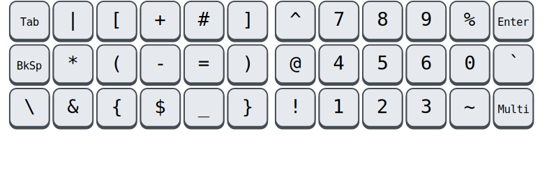

# 🧙 Handalf

*I only uploaded this so that it may serve as inspiration. It is still 
being tweaked. The README may not completely match the implementation. 
It currently only supports Linux.*

Touch typing on a standard keyboard could be better. Your thumbs idle 
while your weakest finger contorts to reach keys like <kbd>Esc</kbd> and 
<kbd>BkSp</kbd>. Numbers and other common symbols require you to abandon 
a comfortable hand position entirely. Exotic keyboards can remedy all 
this, but lack portability.

Handalf is a keyboard layout scheme that works well for fancy keyboards 
with 2 or more thumb keys per hand, but it *also* fits broadly within 
the constraints of a laptop keyboard.

-   **Each finger travels one key at most.** Your thumbs pick up the 
    slack.
-   **Graceful degradation.** You can keep a consistent layout, even 
    when you're stuck on a laptop keyboard.
-   **Easy to learn & remember.** The alpha keys won't change from 
    whatever layout you already use, and all other symbols are 
    accessible with the <kbd>AltGr</kbd> modifier on its own. There is a 
    *single* additional layer beyond that, for navigation and function 
    keys. No need to learn it all at once: I've found the symbols under 
    <kbd>AltGr</kbd> to be the most ergonomically significant.
-   **No homerow mods.** While typing at speed, keypresses will often 
    overlap, which means that any attempt at overloading alpha keys must 
    resort to timeouts. This introduces [visual delay][pftwp] and can 
    cause misfires. You can train yourself and there are other 
    [ways][urob] to mitigate it, but I have not made such sacrifices 
    here.
-   **Overloading is used sparingly, if at all.** Even for non-alpha 
    keys, overloading has the above downsides, albeit to a lesser 
    degree. Therefore, only a *single* key has judiciously been given 
    double duty: <kbd>Esc</kbd>. Even then, the overload is optional.
-   **Stateless.** Modal editors are great, but only because they can 
    provide continuous feedback about the current mode. Without looking 
    at the keyboard, the only substrate upon which your brain can build 
    associations is the physical position of your hands. Therefore, the 
    key sent to your computer will depend *only* on the keys you are 
    currently pressing, or at most which keys you were pressing some 
    fraction of a second ago.
-   **Regressions are avoided.** When stuffing so much functionality 
    into a cramped space, it is inevitable that some key sequences will 
    become harder to type. However, care has been taken to avoid making 
    assumptions about the programs you will be running. That is, all 
    modifier combinations should still be available, they should still 
    stack in an intuitive and consistent way, and no reasonable shortcut 
    should become impossible to type.

Above all, the layout should **feel good**. Many things are taken into 
consideration: simplicity, rolling motions, muscle memory, semantic 
clustering, symmetry, keeping actions and symbols separate, etcetera --- 
but the final decision is based on vibes alone. :)

Unfortunately, the layout is biased toward right-handed people.

## Symbol keys

If you are currently using Colemak, Workman or good old Qwerty/Azerty, 
then all alpha keys can stay in the same place. The major addition is 
that the **Level-3** symbols on those keys (accessed through 
<kbd>AltGr</kbd>) have been crammed full with numbers and the other 
ASCII symbols for which you would normally have had contort your hands.

> [!NOTE]
> The left-hand side of the keyboard now gives comfortable cross-hand 
> access to common symbols like parentheses, while the number pad can be 
> operated entirely with your right-hand.

## Action keys

The key to the left of <kbd>Space</kbd>, what would have been your 
<kbd>Alt</kbd>, is now the <kbd>Fn</kbd> key. Here, the navigation 
cluster is placed so that you can control the directional keys with only 
your left hand. The F-keys are on the right-hand side.

> [!NOTE]
> Since the F-keys are not often used in modern applications, I use that 
> half for navigating the window manager. Should the F-keys be needed in 
> an application, the window manager enters a passthrough mode upon 
> pressing <kbd>Cancel</kbd>.

In a multitude of operating systems and desktop environments, there 
exists a convention to assign global keybindings to the <kbd>Meta</kbd> 
key (also sometimes referred to as the *Super*, *Windows*, *Command* or 
*GUI*-key). Moreover, a tap on this key should bring up a global menu. 
This is achieved simply by pressing the remaining thumb key while in the 
**Fn** layer: <kbd>Space</kbd>.

## Other tricks

### Backspace

<kbd>BkSp</kbd> takes the place of <kbd>CapsLk</kbd>, avoiding the huge 
move your pinky would have made.

### Sticky modifiers

<kbd>Shift</kbd> and <kbd>AltGr</kbd> are modifiers, but unlike 
<kbd>Ctrl</kbd> and <kbd>Alt</kbd>, they don't access shortcuts --- they 
simply provide more symbols. To make for a more comfortable typing 
experience, these keys are made *sticky* (or *oneshot*). Instead of 
holding and consciously releasing them *just* before pressing the next 
unmodified key, you can just tap once and forget about it. MUch better!

### CapsLock and NumLock

Double tapping <kbd>Shift</kbd> on its own gets you <kbd>CapsLk</kbd> 
and double tapping <kbd>AltGr</kbd> gets you <kbd>NumLk</kbd>.

### Compose

The <kbd>Multi</kbd> key (also called *Compose*) allows you to type 
special characters by typing intuitive keys in succession. For example, 
<kbd>Multi</kbd><kbd>c</kbd><kbd>=</kbd> becomes `€`. This key has been 
placed at the position of <kbd>ShiftL</kbd>.

It is *virtual*, in the sense that there is no physical key that has 
this property by default. We assigned it to the '102nd key', that is, 
the <kbd>\\</kbd>/<kbd>|</kbd> key that would exist to the right of 
<kbd>ShiftL</kbd> on ISO keyboards.

This is a natural choice, because (if your keyboard has this key) it is 
already in the right spot, and there are other ways to generate the 
symbols it is associated with.

### Shift on a standard keyboard

You may have noticed that <kbd>Shift</kbd> is on your right-hand thumb, 
but on a laptop keyboard, that's just <kbd>Space</kbd>! In trying to 
compromise in as unobtrusive a way as possible, I have landed on the 
following:

<kbd>Shift</kbd> will also retain its function at the bottom of the 
outer edges of the keyboard, but, when combined with <kbd>AltGr</kbd> or 
a preceding tap of <kbd>Shift</kbd>, it becomes a either a backslash 
<kbd>\\</kbd> or a <kbd>Multi</kbd>. If you keep holding it, the 
associated <kbd>Shift</kbd> modifier will also stay active.

Both of these keys are often followed by special characters, so you will 
usually need to activate the <kbd>AltGr</kbd> or <kbd>Shift</kbd> 
anyway. In this way, we retain an easily accessible <kbd>Shift</kbd> on 
generic keyboards, without wasting a good spot for a useful symbol key.

Optionally, you can keep shift functionality on only the left side, if 
that suits your typing style.

### Right modifier variants

In general, it doesn't matter whether you press the right or left 
variant of a modifier, so we choose the left arbitrarily. However, some 
tasks, like pulling up a menu or escaping a virtual machine sometimes 
involves tapping a specific modifier on the right side. This is 
accommodated by pressing that modifier in the **Nav/Meta** layer.

<!--
You will often need a decimal point while typing numbers, but it is 
cumbersome to exit the symbol layer just to grab one and return. The 
same holds for the underscore when typing in all-caps. For this reason, 
double-tapping <kbd>Space</kbd> while holding <kbd>AltGr</kbd> will emit 
a decimal point (resulting in `.` or `,` depending on your locale), and 
doing so while holding <kbd>Shift</kbd> will emit an underscore `_`. 
**(TODO)**
-->
<!--
You will usually use the arrows in the **Nav/Meta** layer while typing a 
sentence, but if you continue typing quickly, the **Meta** portion may 
still be active. For this reason, the right half will be disabled when 
pressing something in the **Nav/Meta** layer some milliseconds after 
using the arrow keys. **(TODO)**
-->

## Optional tweaks

By default, the <kbd>Fn</kbd> key accesses a sticky layer that exposes 
'simple' action keys. However, there exist two tempting tweaks to this 
situation.

### Overloading Escape

The <kbd>Fn</kbd> key occupies a very accessible location. Since it does 
not map to a conventional key, we can freely choose to emit a different 
key on tap. <kbd>Esc</kbd> is perfect if you use modal applications like 
Vim. In this case, you lose the <kbd>Ctrl</kbd><kbd>Esc</kbd> on double 
tap, but since you no longer need the <kbd>Esc</kbd> on 
<kbd>Fn</kbd><kbd>a</kbd>, it can become <kbd>Ctrl</kbd><kbd>Esc</kbd>.

This is not the default because of the aforementioned risks to 
overloading.

### Pinky Control

If you do not have the thumb keys to give <kbd>Ctrl</kbd> a good spot, 
you may want to consider the Pinky tweak.

While in the **Fn** layer, the <kbd>a</kbd> on your pinky would turn 
into an overloaded <kbd>Ctrl/Esc</kbd>. Try it --- it makes it very easy 
to type common shortcuts like <kbd>Ctrl</kbd><kbd>c</kbd> and 
<kbd>Ctrl</kbd><kbd>f</kbd>.

However, this tweak is optional, because hiding a modifier behind 
another key violates our design principles. Stack more modifiers on top, 
and you may need to pause your typing to think.

### Combining Pinky Control and Escape Overloading

If you use both of the above tweaks, we get an overloaded 
<kbd>Fn/Esc</kbd> on your left thumb and a sticky <kbd>Ctrl</kbd> on 
your left pinky. Now you lose <kbd>Ctrl</kbd><kbd>Esc</kbd>, but this 
key was deliberately chosen to be useful yet expendable: it can still be 
produced in other ways.

## Keysyms

When you press a key, your keyboard will send a *scancode* to the 
computer; the kernel maps that to a *keycode*; and finally, your 
keyboard layout considers that keycode (along with the active modifiers) 
and emits a *keysym*.

By default, Handalf remaps *symbols* at this keysym level, while other 
keys are mapped at the scan- or keycode-level. Teasing the two apart 
like this has several benefits:

- At the scan- and keycode-level, more tricks can be applied, like 
  overloading.
- But at the keysym-level, your OS is aware of your active layout. You 
  can switch between them in the standard way, with some visual 
  indication.
- It becomes easier to reason about key composition. We don't have to 
  explicitly write and remember rules for how layers and modifiers 
  combine. Suppose, for example, you want to type 
  <kbd>Meta</kbd><kbd>1</kbd>: the first key would be <kbd>&#9680;</kbd> 
  and the second would be <kbd>AltGr</kbd><kbd>n</kbd>.
- For layout-independent keybindings in your window manager, it is 
  important that emitted keycodes stay the same even as symbols change.

Holding <kbd>Shift</kbd> and <kbd>AltGr</kbd> together does not change 
the keysyms, but it does change the keycode. This is helpful in 
applications that read keycodes rather than keysyms, or when you use a 
system in which the layout is not installed.

## Usage and installation

Install [keyd](https://github.com/rvaiya/keyd) (version >=2.3) and run 
`sudo make install`. Activate the `handalf` layout in your environment.

## Notes on modifiers and layers

Modifiers are keys like <kbd>Shift</kbd>, <kbd>AltGr</kbd>, 
<kbd>Control</kbd>, <kbd>Alt</kbd>, and <kbd>Meta</kbd>. These keys are 
sent along with the key you press to modify their behaviour. A layer key 
like <kbd>Fn</kbd> is similar, but it modifies the key directly.

You can rearrange the alphanumeric keys and action keys internally, and 
while some arrangements will be more comfortable than others, it will 
not lead to a fundamentally different typing experience. The same can 
not be said for modifier and layer keys. These keys can be *overloaded*, 
and it is to be expected that they are sometimes pressed in 
*conjunction*. I considered several permutations, landing on the 
following rules:

- The order in which you press modifiers and layers should not matter. 
  That is, holding <kbd>Fn</kbd> and then <kbd>Alt</kbd> should have the 
  same effect as the other way around.
- You should not have to press more than one key to activate a layer or 
  modifier.
- All modifier and layer keys should be on the thumb.
- It should be assumed that the fingers are in the home row position; 
  shifting your fingers a column or row is not always comfortable on 
  sculpted keyboards like the Kinesis Advantage, MoErgo, Dactyl, or 
  Keyboardio Model 100. (Dropping this requirement, along with the one 
  preceding it, allows an interesting variant where the pinky activates 
  a layer in which the arrow keys are on WASD. This works well on laptop 
  keyboards, and frees up a thumb key for <kbd>Ctrl</kbd>.)

<!--
- When overloading a modifier, take care of potential misfires: choose 
  'tap' actions that are not destructive, and make sure that the 'hold' 
  actions are also safe. This is easier to do when associating the 
  overloaded key with Window Manager actions.
-->

### More keys

Actual numpad keys and media control keys have been left out of the 
layout. However, it would make sense to add them on an extra layer.

<!--
## Other

[Seniply] and [Callum] have similar goals: limited keys and no home-row 
mods.

# Consideration for the thumb keys

-   All thumb keys except space are modifiers or layer keys, because you 
    have full range of motion with the rest of your fingers while 
    holding them.
-   Since we avoid crazy modifier combinations, `sym` and `shift` never 
    make sense to press together. Therefore, they should be on the same 
    finger.
-   `space` should be opposite from  `shift` and `sym`, so that you can 
    still use it while in their respective modes.

-->

<!-- Reading -->
[Preconditions-Guide]: https://precondition.github.io/home-row-mods
[Urob]: https://github.com/urob/zmk-config#timeless-homerow-mods
<!-- About visual latency -->
[pftwp]: https://pavelfatin.com/typing-with-pleasure/#human-side

<!-- Layouts -->
[Colemak-DH]: https://colemakmods.github.io/mod-dh/
[Workman]: https://workmanlayout.org/

<!-- More layouts -->
[Seniply]: https://stevep99.github.io/seniply/
[Callum]: https://github.com/callum-oakley/qmk_firmware/tree/master/users/callum
[Miryoku]: https://github.com/manna-harbour/miryoku
