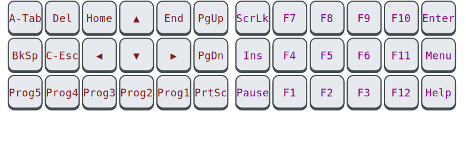

# 🧙 Handalf

*I only uploaded this so that it may serve as inspiration. It is still 
being tweaked. The README may not completely match the implementation. 
It currently only supports Linux.*

Touch typing on a standard keyboard could be better. Your thumbs idle 
while your weakest finger contorts to reach keys like <kbd>Esc</kbd> and 
<kbd>BkSp</kbd>. Numbers and other common symbols require you to abandon 
a comfortable hand position entirely. Exotic keyboards can remedy all 
this, but lack portability.

Handalf is a keyboard layout that works well for fancy keyboards with 2 
or more thumb keys per hand, but it *also* fits broadly within the 
constraints of a laptop keyboard.

-   **Each finger travels one key at most.** Your thumbs pick up the 
    slack.
-   **Graceful degradation.** You can keep a somewhat consistent layout 
    even when you're stuck on a laptop keyboard. Only the backslash key 
    <kbd>\\</kbd> is used slightly differently.
-   **Easy to learn & remember.** The letter keys won't change, and all 
    other symbols are accessible with *only* the <kbd>AltGr</kbd> 
    modifier. There is a *single* additional layer beyond that, for 
    navigation and function keys. There's no need to learn it all at 
    once; I've found the symbols under <kbd>AltGr</kbd> to be the most 
    ergonomically significant.
-   **No homerow mods.** While typing at speed, keypresses will often 
    overlap, which means that any attempt at overloading alpha keys must 
    resort to timeouts. This introduces [visual delay][pftwp] and can 
    cause misfires. You can train yourself and there are other 
    [ways][urob] to mitigate it, but I have not made such sacrifices 
    here.
-   **Overloading is used sparingly.** Even on non-alpha keys, 
    overloading has the above downsides, albeit to a lesser degree. 
    Therefore, only *one* key has two functions, because it tends to 
    punctuate a keystroke anyway: <kbd>Esc</kbd>.
-   **Stateless.** Modal editing is great, but you shouldn't need to 
    remember what state your keyboard is in. The key that your software 
    sees will depend only on what keys you are *currently* pressing, or 
    at most which keys you were pressing some fraction of a second ago.
-   **Regressions are avoided.** When stuffing so much functionality 
    into a limited space, it is inevitable that some key sequences will 
    become hard to type. However, care has been taken to avoid making 
    assumptions about the programs you will be running. That is, all 
    modifier combinations should still be available, they should still 
    stack in an intuitive and consistent way, and no reasonable shortcut 
    should be made impossible to type.

Above all, the layout should **feel good**. Many things are taken into 
consideration: simplicity, rolling motions, muscle memory, semantic 
clustering, symmetry, keeping actions and symbols separate, etcetera --- 
but the final decision is based on vibes. :)

Unfortunately, the layout is biased toward right-handed people.

## Symbols

If you are currently using US Colemak or Workman or good ol' Qwerty, 
then all alpha keys will stay in the same place. The major addition is 
that the Level-3 symbols on those keys (accessed through 
<kbd>AltGr</kbd>) have been crammed full with numbers and the other 
ASCII symbols for which you would normally have had contort your hands.

<!-- Because AltGr is pressed with your right-hand thumb, the left-hand 
side of the keyboard is preferred for things like parentheses, while the 
number pad can now be operated entirely with your right-hand. -->

## Action keys and Escape

The key to the left of <kbd>Space</kbd>, what would have been your 
<kbd>Alt</kbd>, now is the *action* key, which exposes the **Nav/Fn** 
layer that holds the navigation cluster and F-keys. Tragically, this 
layer has been split in twain.

[^1]: *Meta* is also sometimes referred to as the *Super*, *Windows*, 
*OS* or *GUI*-key.

- The action key first activates the **Nav/Meta** layer. Here, the 
  navigation cluster is placed so that you can control the directional 
  keys with only your *left* hand. The *right*-hand side exposes normal 
  keys augmented with the <kbd>Meta</kbd> modifier, handy for mapping 
  actions in your window manager.

- This is flipped around by also holding <kbd>Space</kbd>: then the 
  layer becomes **Meta/Fn**, in which the *left* side holds 
  <kbd>Meta</kbd>-keys and the *right*-hand side has your F-keys.

- Just tapping <kbd>Space</kdb> will emit <kbd>Meta</kdb> on its own, 
  which plays well with the convention, as established in multiple OSes 
  and DEs, of having <kbd>Meta</kdb> bring up a global menu.

This criss-crossed approach is an aesthetic sacrifice, worth it for the 
practical convenience it brings. After all, the F-keys are not often 
used in modern applications. And while it is useful to reserve some 
<kbd>Meta</kbd> keys for frictionless window manager bindings, half a 
keyboard should be plenty for that purpose.

<!--
<kbd>Space</kbd>, being a thumb key and having no associations with any 
other modifier, is the obvious choice for switching between these two 
half-layers.
-->

### Overloading the action key

The action key occupies a very accessible location. Since it does not 
map to a conventional key, we can choose an additional action on tap 
without worry.

<kbd>Meta</kbd> would be a good choice, but if you use modal 
applications like Vim, which I imagine many people interested in this 
document do, <kbd>Esc</kbd> is a more useful choice.

## Other changes

### Sticky modifiers

<kbd>Shift</kbd> and <kbd>AltGr</kbd> are modifiers, but unlike 
<kbd>Ctrl</kbd> and <kbd>Alt</kbd>, they don't access shortcuts --- they 
simply provide more symbols. To make for a more comfortable typing 
experience, these keys are made *sticky* (or *oneshot*). Instead of 
holding and consciously releasing them *just* before pressing the next 
unmodified key, you can just tap once and forget about it. MUch better!

### Shift

We need to compromise on the lack of thumb keys on a laptop keyboard, in 
as unobtrusive a way as possible. I have landed on the following:

<kbd>Shift</kbd> will retain its function on a laptop keyboard, but, 
combined with the <kbd>Shift</kbd>- or <kbd>AltGr</kbd> modifier, it 
becomes a backslash. That is, double tapping <kbd>Shift</kbd>, or 
tapping while holding <kbd>AltGr</kbd>, will get you `\`, and if you 
keep holding it, the associated <kbd>Shift</kbd> modifier will also stay 
active.

Because `\` is often for escaping, it will often be followed by a 
special character. Therefore, you would have needed to activate 
<kbd>AltGr</kbd> or <kbd>Shift</kbd> *anyway*! And so, in this way, we 
retain an easily accessible <kbd>Shift</kbd> on generic keyboards, 
including oneshot behaviour, without wasting a good spot for a useful 
symbol key.

### Backspace

<kbd>BkSp</kbd> takes the place of <kbd>CapsLk</kbd>, avoiding the huge 
move your pinky would have made.

### Locking

Holding <kbd>Shift</kbd> on its own gets you <kbd>CapsLk</kbd> and 
holding <kbd>AltGr</kbd> gets you <kbd>NumLk</kbd>.

### Compose

The <kbd>Multi</kbd> key (also called *Compose*) allows you to type 
special characters by typing intuitive keys in succession. For example, 
<kbd>Multi</kbd><kbd>c</kbd><kbd>=</kbd> becomes `€`. This key has been 
placed at the position of <kbd>ShiftR</kbd>.

### Right modifier variants

In general, it doesn't matter whether you press the right or left 
variant of a modifier, so we choose the left arbitrarily. However, 
pulling up a menu or escaping a virtual machine sometimes involves 
tapping a specific modifier on the right side, which is accommodated by 
pressing that modifier in the **Nav/Meta/Fn** layer.

<!--
You will often need a decimal point while typing numbers, but it is 
cumbersome to exit the symbol layer just to grab one and return. The 
same holds for the underscore when typing in all-caps. For this reason, 
double-tapping <kbd>Space</kbd> while holding <kbd>AltGr</kbd> will emit 
a decimal point (resulting in `.` or `,` depending on your locale), and 
doing so while holding <kbd>Shift</kbd> will emit an underscore `_`. 
**(TODO)**
-->
<!--
You will usually use the arrows in the **Nav/Meta** layer while typing a 
sentence, but if you continue typing quickly, the **Meta** portion may 
still be active. For this reason, the right half will be disabled when 
pressing something in the **Nav/Meta** layer some milliseconds after 
using the arrow keys. **(TODO)**
-->

# Keysyms

When you press a key, your keyboard will send a *scancode* to the 
computer; the kernel maps that to a *keycode*; and finally, your 
keyboard layout considers that keycode (along with the active modifiers) 
and emits a *keysym*.

By default, Handalf remaps *symbols* at this keysym level, while other 
keys are mapped at the scan- or keycode-level. Teasing the two apart 
like this has several benefits:

- At the scan- and keycode-level, more tricks can be applied, like 
  overloading.
- But at the keysym-level, your OS is aware of your active layout. You 
  can switch between them in the standard way, with some visual 
  indication.
- It becomes easier to reason about key composition. We don't have to 
  explicitly write and remember rules for how layers and modifiers 
  combine. Suppose, for example, you want to type 
  <kbd>Meta</kbd><kbd>1</kbd>: the first key would be <kbd>Action</kbd> 
  and the second would be <kbd>AltGr</kbd><kbd>n</kbd>.
- For layout-independent keybindings in your window manager, it is 
  important that emitted keycodes stay the same even as symbols change.

Holding <kbd>Shift</kbd> and <kbd>AltGr</kbd> together does not change 
the keysyms, but it does change the keycode. This is helpful in 
applications that read keycodes rather than keysyms, or when you use a 
system in which the layout is not installed.

## Usage and installation

Install [keyd](https://github.com/rvaiya/keyd) (version >=2.3) and run 
`sudo make install`. Activate the `handalf` layout in your environment.

<!--
## Other

[Seniply] and [Callum] have similar goals: limited keys and no home-row 
mods.

# Consideration for the thumb keys

-   All thumb keys except space are modifiers or layer keys, because you 
    have full range of motion with the rest of your fingers while 
    holding them.
-   Since we avoid crazy modifier combinations, `sym` and `shift` never 
    make sense to press together. Therefore, they should be on the same 
    finger.
-   `space` should be opposite from  `shift` and `sym`, so that you can 
    still use it while in their respective modes.

-->

<!-- Reading -->
[Preconditions-Guide]: https://precondition.github.io/home-row-mods
[Urob]: https://github.com/urob/zmk-config#timeless-homerow-mods
<!-- About visual latency -->
[pftwp]: https://pavelfatin.com/typing-with-pleasure/#human-side

<!-- Layouts -->
[Colemak-DH]: https://colemakmods.github.io/mod-dh/
[Workman]: https://workmanlayout.org/

<!-- More layouts -->
[Seniply]: https://stevep99.github.io/seniply/
[Callum]: https://github.com/callum-oakley/qmk_firmware/tree/master/users/callum
[Miryoku]: https://github.com/manna-harbour/miryoku
